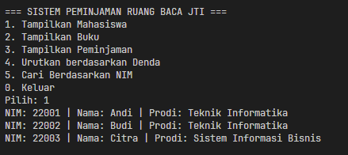
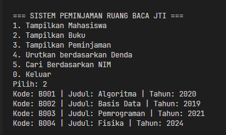
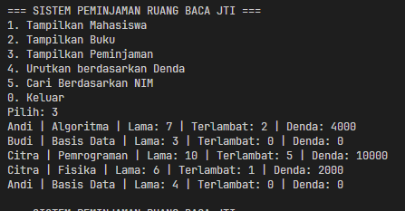
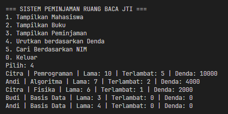
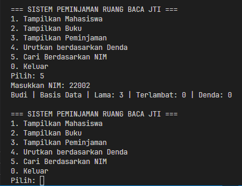
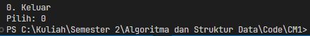

|  | Algorithm and Data Structure |
|--|--|
| NIM |  254107020097|
| Nama | Ahmad Raffi |
| Kelas | T1 - 1F |
| Repository | [link] (https://github.com/rapiBeginner/ASD-2026/blob/main/Minggu5) |

# Case Method 1

1. Tampilkan Mahasiswa

2. Tampilkan Buku

3. Tampilkan Peminjaman

4. Urutkan berdasarkan Denda

5. Cari berdasarkan NIM

6. Keluar

