|  | Algorithm and Data Structure |
|--|--|
| NIM |  254107020097|
| Nama | Ahmad Raffi |
| Kelas | T1 - 1F |
| Repository | [link] (https://github.com/rapiBeginner/ASD-2026/blob/main/Minggu1) |

# Labs #1 Programming Fundamentals Review

## 1.1 Selection Solution

The solution is implemented in Pemilihan.java, and below is screenshot of the result.

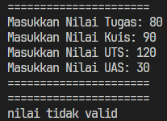
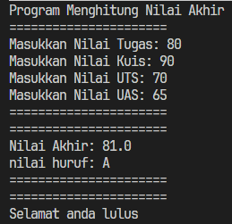

**Brief explanaton:** There are 4 main step: 
1. Input all grades
2. Validate the input
3. Calculate and convert the final grade
4. Decide the final status

## 1.2 Looping Solution

You can see the code for this in Perulangan.java, here is the result of that program.

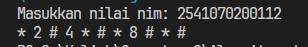

**Brief explanation:** These are some steps about how it works:
1. Get the NIM input
2. Modulus the NIM by 100 to get the last two digits, then store it (n for example)
3. Make e loop starting from 1 to n, include these logic below inside the loop
4. Put some logic to decide what would be printed out based on the current number

## 1.3 Array Solution

This program is implented in Array.java, and you can see the outcome here below

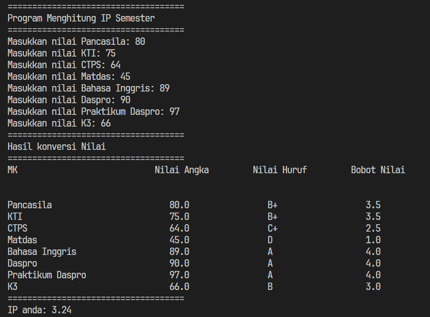

**Brief explanation** Here is how it works:
1. Input grade for every single subject with a loop
2. Put some selection to decide the "letter category" and "index grade" for every subject
3. Calculate the IP
4. Print out the subject, letter category, index grade, and the IP

## 1.4 Function Solution

Fungsi.java would show you the code for this solution, as you can see on the result below:

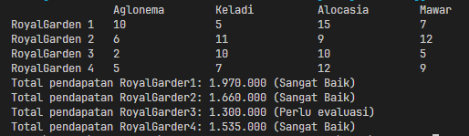

**Brief explanation** These steps below would explain how it work:
1. Print out the stock and of flower for every store.
2. Calculate total revenue of every store, by multiplying every stock with its price
3. Make a logic of selection to determine the status based on revenue
4. Display the revenue and status for every store.

## 1.5 Assignment 1

in Tugas1.java, you could review the code for this solution

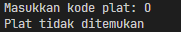
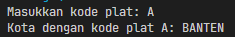

**Brief explanation** Few steps to get the result:
1. Get the input of the vehicle code
2. Validate if it available
3. if it does, display the city with the same index of the vehicle code
4. But if the code isnt available, display the "not found" error message

## 1.6 Assignment 2

The last assigment for this chapter is in Tugas2.java, which the output would be displayed below:

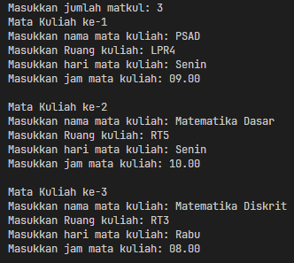
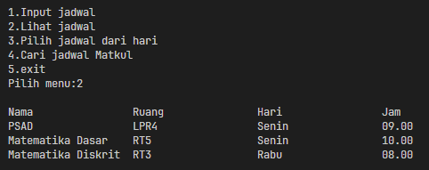
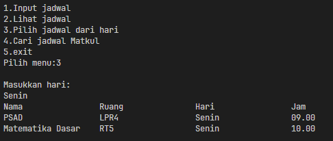
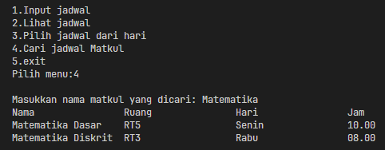

**Brief explanation** Here is the brief explanation on how it work:
1. Make a function to input all of the subject schedule 
2. Make a functiom to display it all
3. Make a function to filter it by the day and the name of subject
4. Display it all with a loop menu 

