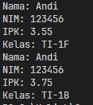
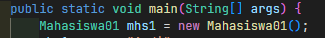

|  | Algorithm and Data Structure |
|--|--|
| NIM |  254107020097|
| Nama | Ahmad Raffi |
| Kelas | T1 - 1F |
| Repository | [link] (https://github.com/rapiBeginner/ASD-2026/blob/main/Minggu2) |

# Labs #2 Objek

## 2.1 Percobaan 1: Deklarasi Class, Atribut dan Method

### 2.1.1 Penjelasan Singkat
1. Membuat kelas mahasiswa 
2. Memberi beberapa properti, serta method untuk memodifikasi ataupun menampilkan atributnya
3. Tidak ada main method, sehingga tidak bisa di run

### 2.1.2 Pertanyaan
1. Dua karakteristik objek: memiliki sesuatu (atribut), dan melakukan sesuatu (method)
2. Ada 4 atribut yang dimiliki: nama, nim, ipk, dan kelas
3. Ada 4 method yang dimiliki: tampilkanInformasi, ubahKelas, updateIPK, nilaiKinerja
4. 
5. Menilai kinerja berdasarkan rentang IPK tertentu, lebih dari sama dengan 3.5 terkategori sangat baik, hingga dibawah 2.0 termasuk kurang. Keterangan kinerja tersebut dikembalikan oleh method tersebut dengan format string.

## 2.2 Percobaan 2: Instansiasi Object, serta Mengakses Atribut dan Method

### 2.2.1 Penjelasan Singkat
1. Membuat kelas baru, dengan main method
2. Didalam main method membuat objek dari kelas mahasiswa
3. Mengisi atribut dan menjalankan methodnya

### 2.2.2 Pertanyaan
1. 
Objek yang dihasilkan diberi nama mhs01
2.  Dengan cara menyebutkan nama objek, memberi titik, lalu nama atribut atau methodnya, (namaObjek.namaAtribut atau namaObjek.namaMethod())
3. Karena diantara kedua pemanggilan itu, ada method ubahKelas dan updateIPK yang dijalankan, dimana mengubah keterangan kelas dan ipk nya sebelum ditampilkan kembali.

