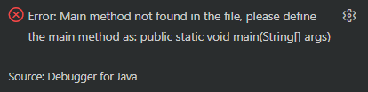
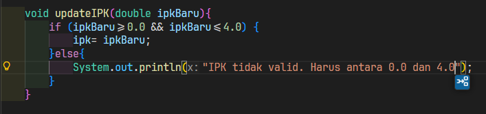

|  | Algorithm and Data Structure |
|--|--|
| NIM |  254107020097|
| Nama | Ahmad Raffi |
| Kelas | T1 - 1F |
| Repository | [link] (https://github.com/rapiBeginner/ASD-2026/blob/main/Minggu1) |

# Labs #2 Objek

## 2.1 Percobaan1: Deklarasi Class, Atribut dan Method

### 2.1.1 Pertanyaan
1. Dua karakteristik objek: memiliki sesuatu (atribut), dan melakukan sesuatu (method)
2. Ada 4 atribut yang dimiliki: nama, nim, ipk, dan kelas
3. Ada 4 method yang dimiliki: tampilkanInformasi, ubahKelas, updateIPK, nilaiKinerja
4. 
5. Menilai kinerja berdasarkan rentang IPK tertentu, lebih dari sama dengan 3.5 terkategori sangat baik, hingga dibawah 2.0 termasuk kurang. Keterangan kinerja tersebut dikembalikan oleh method tersebut dengan format string.
