|  | Algorithm and Data Structure |
|--|--|
| NIM |  254107020097|
| Nama | Ahmad Raffi |
| Kelas | T1 - 1F |
| Repository | [link] (https://github.com/rapiBeginner/ASD-2026/blob/main/Minggu3) |

# Labs #3 Array Objek

## 3.1 Percobaan 1: Membuat Array dari Objek, Mengisi dan Menampilkannya

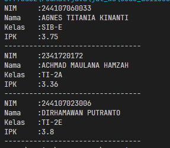

### 3.1.1 Penjelasan Singkat
1. Buat kelas Mahasiswa dengan beberapa atribut
2. Buat kelas MahasiswaDemo dengan main method
3. Buat array berisi objek Mahasiswa di dalam main method
4. Isi Array dengan Objek dan lengkapi Atributnya
5. Print setiap nilai atribut objek pada array

### 3.1.2 Pertanyaan
1. Pembuatan Array of Objek tidak mengharuskan objeknya memiliki Atribut dan method, Selama kelas tersebut memang terdefinisikan dan bisa diinstansiasi maka bisa dijadikan Array
2. Melakukan instansiasi sebuah Array yang akan berisi objek dari kelas Mahasiswa, sebanyak 3 slot.
3. Karena ketika sebuah kelas tidak kita beri sebuah konstruktor, maka java akan secara otomatis menyediakan sebuah konstruktor kosong sehingga kelas tersebut bisa di instansiasi.
4. Membuat objek Mahasiswa di dalam Array arrayOfMahasiswa pada index pertama, kemudian mengisi setiap atributnya
5. Kita tidak bisa membuat dua kelas public didalam satu file yang sama, oleh karena itu kedua kelas tersebut dipisahkan kedalam dua file yang berbeda

## 3.2 Percobaan 2: Menerima Input Isian Array Menggunakan Looping 

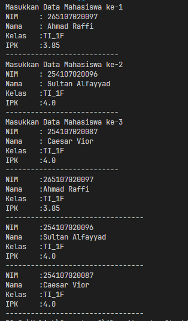

### 3.2.1 Penjelasan Singkat
1. Ganti input tiap index menggunakan metode looping
2. Ganti output tiap index menggunakan metode looping

### 3.2.2 Pertanyaan 
1. 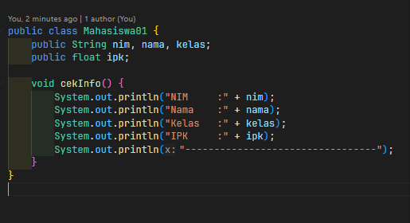

   

2. Karena didalam kode tersebut tidak ada instansiasi objek kedalam index pertama array, maka ketika kita berusaha mengisi atributnya akan menyebabkan error karena objek yang diakses atributnya belum tersedia.

## 3.3 Percobaan 3: Constructor Berparameter

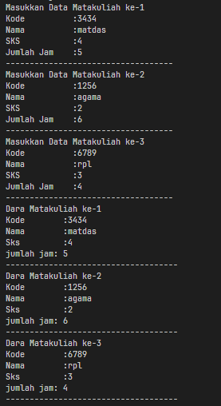

### 3.3.1 Penjelasan singkat
1. Buat kelas MataKuliah dengan konstruktor berparameter
2. Buat kelas lain dengan main method
3. Dalam main method, buat array yang bertipe data kelas MataKuliah
4. Isi array nya dengan inisialsisasi objek MataKuliah pada tiap index, isi parameter dengan hasil inputan

### 3.3.2 Pertanyaan
1. Bisa, namun konstruktor tersebut harus memiliki parameter yang berbeda, contoh: 

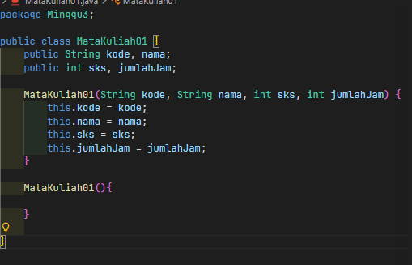

2. Menambahkan method tambahData():

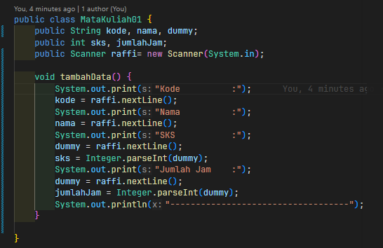
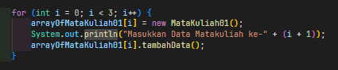

3. Tambahkan method cetakInfo()

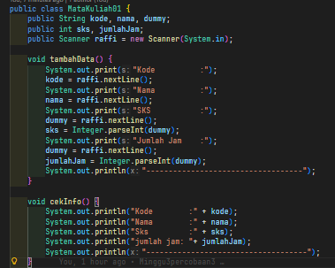
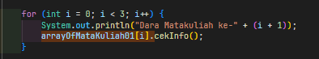

4. Modifikasi agar panjang array dinamis sesuai input user:

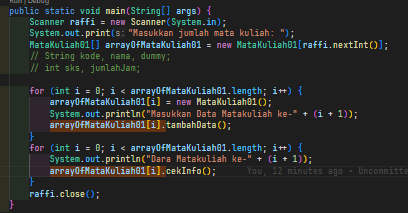
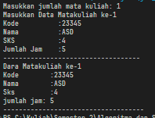

### 3.4 Tugas
1. Data dosen:
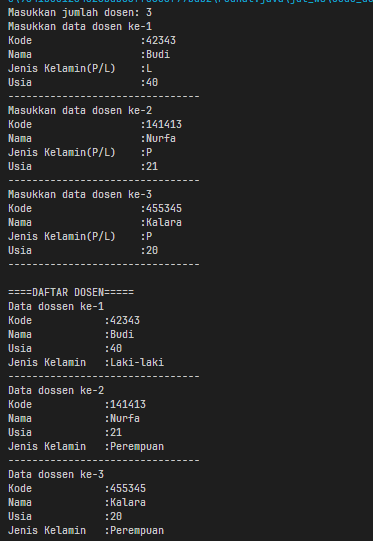

2. Modifikasi dan pemanbahan fitur
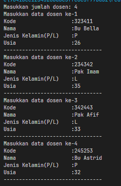
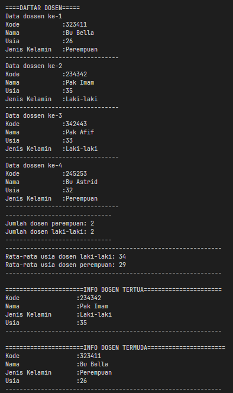
<!-- 2.  -->