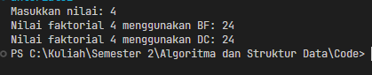
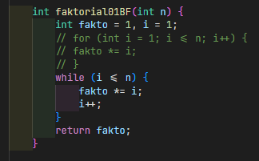
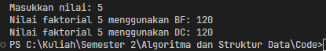
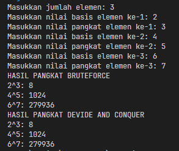
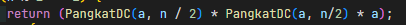
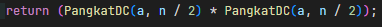
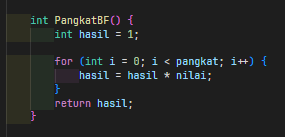
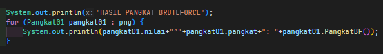
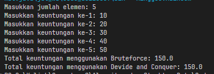
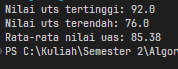

|  | Algorithm and Data Structure |
|--|--|
| NIM |  254107020097|
| Nama | Ahmad Raffi |
| Kelas | T1 - 1F |
| Repository | [link] (https://github.com/rapiBeginner/ASD-2026/blob/main/Minggu5) |

# Labs #5 Brute Force dan Devide Conquer 

## 5.1 Percobaan 1: Menghitung Nilai Faktorial dengan Algoritma Brute Force dan Divide and Conquer 

### 5.1.1 Penjelasan singkat
1. Membuat sebuah kelas dengan dua buah method yang sama-sama menghitung faktorial
2. Satu fungsi menggunakan looping, satunya melakukan pemanggilan rekursif
3. Jalankan keduanya di main method kelas lain

### 5.1.2 Pertanyaan 
1. Kode bagian if menentukan kapan tahap ekspansi akan berhenti, sementara blok else lah yang menjalankan bagian ekspansi sekaligus subtitusinya (rekursion call)
2. Selain menggunakan for bisa menggunakan while 

3. fakto *=i; memulai dari angka yang terkecil , 3! = 1x2x3. Sementara fakto= n * faktorialDC(n-1); memulai dari arah sebaliknya , 3! = 3x2x1
4. faktorialBF() menggunakan methode looping, dimana ini adalah pendekatan brute force yang mememberikan solusi secara langsung dan sederhana. Sementara faktorialDC() menggunakan konsep devide conquer, memecah masalah menjadi bagian yang lebih kecil.Menggunakan metode fungsi rekursif, dia bergerak dari angka terbesar ke terkecil.

## 5.2 Percobaan 2: Menghitung Hasil Pangkat dengan Algoritma Brute Force dan Divide and Conquer 

### 5.2.1 Penjelasan singkat
1. Membuat sebuah kelas dengan dua buah method yang sama-sama menghitung pangkat
2. Satu fungsi menggunakan looping, satunya melakukan pemanggilan rekursif
3. Jalankan keduanya di main method kelas lain

### 5.2.2 Pertanyaan
1. pangkatBF() menggunakan metode brute force dengan looping, solusi ini sederhana namun memerlukan waktu yang lama untuk pangkat besar. Sementara pangkatDC() membawa pendekatan devide conquer, memecah masalah menjadi bagian yang lebih kecil sehingga pengerjaaan memakan waktu yang lebih sedikit terutama ketika menerima input nilai yang besar

2. Sudah, tahap combine terdapat pada method pangkatDC(), pada bagian return rekursion call. Bagian ini disebut combine karena menggabungkan hasil satu proses dan proses lainnya agar mencapai tujuan akhir.

3. Pada dasarnya penggunaan parameter pada pangkatBF tidaklah diperlukan, karena sudah ada atribut yang dapat diakses oleh method tersebut, dimana nilai atributnya sudah pasti terisi saat inisialisasi dikarenakan konstruktor berparameter

4. pangkatBF() bekerja dengan menerima basis angka yang akan dipangkatkan, serta berapa banyak kelipatan pangkatnya. Dilakukan sebuah iterasi dimana dia mulai mengalikan basis angka dengan basis angia itu sendiri sebanyak jumlah pangkatnya, kemudian mengembalikan hasilnya dalam bentuk angka bulat (2^4= 2x2=4x2=8x2=16). 
Sementara itu, pangkatDC() tidak langsung mengalikan satu persatu, namun membaginya ke permasalahan yang lebih kecil, ketika solusi dari masalah terkecil ditemukan, dia disubtitusikan kembali keatas hingga menemukan hasil yang dicari (2^4 = 2^2x2^2 dan seterusnya)

## 5.3 Percobaan3:  Menghitung Sum Array dengan Algoritma Brute Force dan Divide and Conquer

### 5.3.1 Penjelasan Singkat
1. Membuat sebuah kelas untuk menghitung total keuntungan dari menjumlahkan data dalam array
2. Buat dua method untuk menjumlahkan keuntungann, satu dengan looping satunya dengan metode rekursif
3. Jalankan keduanya pada kelas lain dengan method main

### 5.3.2 Pertanyaan 
1. Karena dalam totalDC() array terus dibagi menjadi dua bagian yang sama besar antara kiri dan kanan, oleh karena itu diperlukan variabel mid untuk menentukan titik tengah sebagai batasan antara bagian kiri dan kanan.
2. Kedua statement tersebut membelah array menjadi dua bagian secara terus menerus hingga mencapai base case, bagian kiri atau lsum dimulai dari kiri ke sampai tengah, sementara bagian kanan atau rsum dimulai dari tengah + 1 sampai ke ujung kanan
3.  Karena pada akhirnya ketika ekspansi sudah selesai dan akan memasuki tahap subtitusi, hasil yang dicari adalah menjumlahkan semua data pada array. Oleh karena itu hasil dari bagian kiri dan kanan harus dijumlahkan hingga mencapai nilai yang diinginkan.
4. Base case dari totalDC() adalah kondisi ketika nilai kiri dan kanan adalah sama, ini berarti masalah sudah dibagi menjadi bagian yang paling kecil yaitu satu data saja, tidak bisa dibagi ke kiri dan kanan lagi.

## 5.4 Latihan Praktikum

