|  | Algorithm and Data Structure |
|--|--|
| NIM |  254107020097|
| Nama | Ahmad Raffi |
| Kelas | T1 - 1F |
| Repository | [link] (https://github.com/rapiBeginner/ASD-2026/blob/main/Minggu6) |

# Labs 6 Searching

## 6.2 Searching Menggunakan ALgoritma Sequential Search

 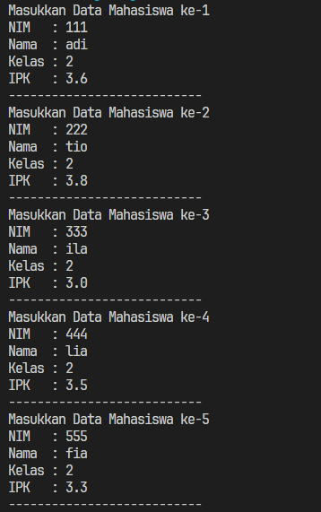

 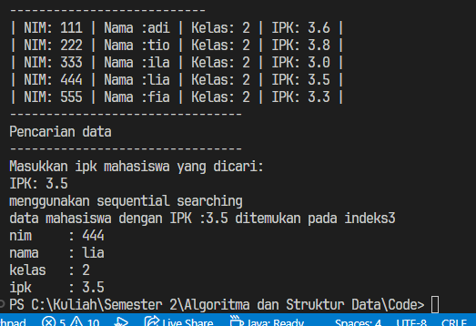

 ### 6.2.1 Pertanyaan
 1. tampilDataSearch menampilkan data yang ditemukan dari hasil searching sementara tampilPosisi memberitahukan data yang ditemukan dari searching itu posisinya ada di index berapa.

 2. break pada program tersebut bertujuan untuk menghentikan perulangan jika data yang dicari sudah ditemukan

 3. Variabel pos digunakan sebagai penentu dimana data yang dicari ditemukan, jadi saat program ingin menampilkan atau mengambil data yang dimaksud, tinggal sebut saja array mahasiswa pada index pos (didapat setelah menjalankan fungsi sequential sort dan menerima returnya), dan jika pos ini nilainya -1 berarti data yang dicari tidak ada maka jangan diakses array dengan index pos tersebut karena pasti out of bound
 
 4. Jika ada lebih dari satu data dengan nilai pertama, hasil pencarian sequeantial search tersebut adalah data yang paling awal dalam urutan array, karena ketika dia menemukan data yang dicari, perulangan langsung berhenti sehingga data dengan nilai sama setelah yang pertama ditemukan, tidak akan dihiraukan.
(misal dicari ipk 3.0, ternyata ipk 3.0 ada di index 2 dan index 5, maka yang dikembalikan hanyalah nilai index 2 saja)
 
 5. Jika break dihapus, looping tidak akan berhenti meskipun data yang dicari sudah ditemukan, sehingga, semisal ada 2 data yang cocok dengan nilai searching, yang diambil justru data di urutan yang akhir, karena yang awal akan tergantikan.
 (misal dicari ipk 3.0, ternyata ipk 3.0 ada di index 2 dan index 5, maka yang dikembalikan hanyalah nilai index 5)

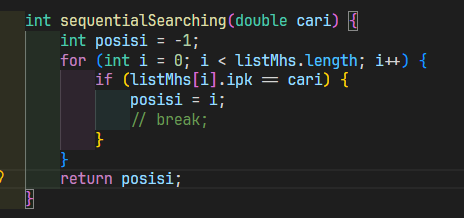

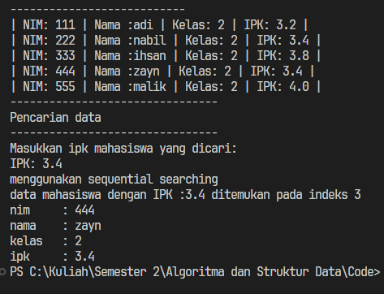

## 6.3 Searching/ Pencarian Menggunakan Algoritma Binary Search

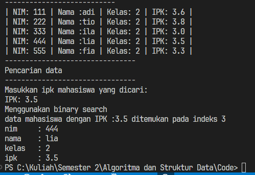

 ### 6.3.1 Pertanyaa
 1. 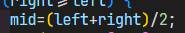

 2. 1[Screenshot](img/percobaan2Pertanyaan2.png)

 3. Fungsi left, right, dan mid di binary search itu buat menentukan batas pencarian. left menyimpan batas kiri (index awal), right menyimpan batas kanan (index akhir), dan mid menyimpan index tengah antara left sampai right yang digunakan untuk membagi pencarian

 4. Programnya tetap bisa berjalan (tidak error), tapi hasilnya bisa salah / tidak ketemu, walaupun data IPK sebenarnya ada. Karena Binary Search hanya bekerja dengan benar jika data sudah terurut (sorted). Kalau datanya acak/tidak urut, keputusan “ke kiri atau ke kanan” jadi tidak valid, karena nilai yang dicari bisa saja ada di bagian yang dibuang.

 5. Kalau datanya urut dari terbesar ke terkecil (descending),
 Karena kode dibuat untuk data ascending (kecil → besar). Perubahannya:

 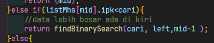

 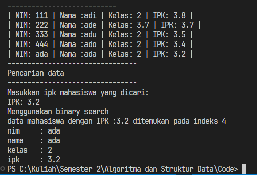

 6. Binary search bilang tidak ditemukan jika setelah pembagian terus-menerus, akhirnya batas kiri melewati batas kanan, sehingga tidak ada elemen yang bisa dicek lagi.

 7. 

 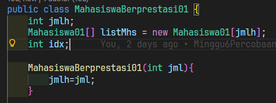

 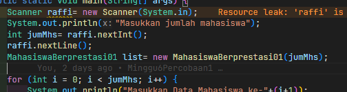

 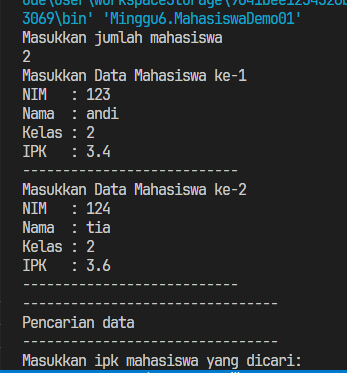