|  | Algorithm and Data Structure |
|--|--|
| NIM |  254107020097|
| Nama | Ahmad Raffi |
| Kelas | T1 - 1F |
| Repository | [link] (https://github.com/rapiBeginner/ASD-2026/blob/main/Praktikum5) |

# Labs #5 SORTING (BUBBLE, SELECTION, DAN INSERTION SORT)

## 5.1 Percobaan 1: Mengimplementasikan Sorting menggunakan object

### 5.1.1 Penjelasan Singkat

#### A. Sorting - bubble sort

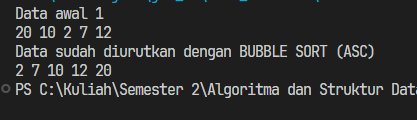

1. Buat sebuah class dengan array integer
2. Buat method untuk menampilkan dan mengurutkan secara bubble sort
3. Dimana setiap elemen dibandingan dengan elemen didepanya jika lebih besar akan ditukar posisinya
4. Buat objek dari class tersebut di class lain
5. Panggil method untuk menampilkan sebanyak dua kali, sebelum dan sesudah method mengurutkan dipanggil

#### B. Sorting - selection sort

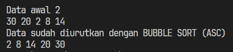

1. Buat method untuk menampilkan dan mengurutkan secara bubble sort
2. Dimana untuk menentukan nilai suatu index, dibandingkan dulu dengan semua nilai di sebelah kananya, jika dia yang paling kecil diantara seluruh elemen di kanan, dan lebih kecil juga dibanding elemen yang menempati index saat ini, mana akan ditukar posisinya
3. Buat objek dari class tersebut di class lain
4. Panggil method untuk menampilkan sebanyak dua kali, sebelum dan sesudah method mengurutkan dipanggil

#### C. Sorting - insertion sort

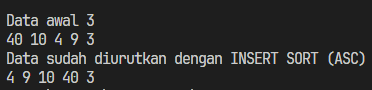

1. Buat method untuk menampilkan dan mengurutkan secara insertsion sort
2. Dimana untuk menentukan nilai suatu index, dibandingkan dulu dengan semua nilai di sebelah kananya, jika dia yang paling kecil diantara seluruh elemen di kanan, dan lebih kecil juga dibanding elemen yang menempati index saat ini, mana akan ditukar posisinya
3. Buat objek dari class tersebut di class lain
4. Panggil method untuk menampilkan sebanyak dua kali, sebelum dan sesudah method mengurutkan dipanggil

### 5.1.2 Pertanyaan
1. Kode tersebut berfungsi untuk menukar nilai index sekarang dengan index disebelah kirinya, jika index yang disebelah kiri tersebut lebih besar dari data di index sekarang

2. 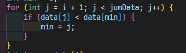

3. Kondisi ini digunakan untuk melakukan pengecekan apakah nilai j (index yang ada di belakang temp) lebih besar dari nilai temp dan itu sendiri. Indexnya tidak boleh lebih kecil dari 0, jika kedua kondisi itu terpenuhi maka akan masuk kedalam loop

4. Ini digunakan untuk meletakkan nilai j ke index dikanannya

## 5.2 Sorting Menggunakan Array of Object
### 5.2.1 Mengurutkan Data Mahasiswa Berdasarkan IPK(Bubble Sort)

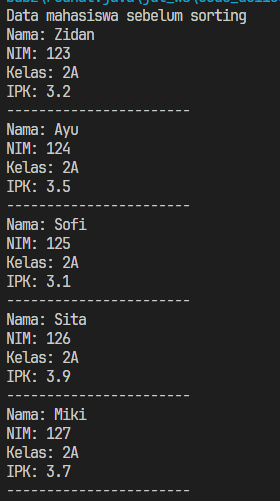
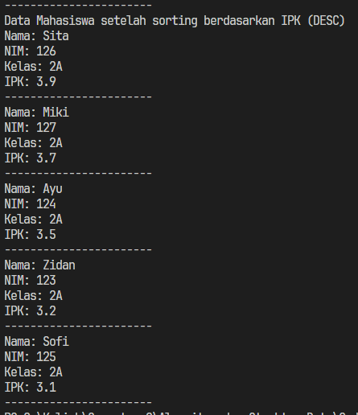

#### 5.2.1.1 Penjelasan singkat
1. Buat kelas mahasiswa dengan atribut-atributnya
2. Buat kelas mahasiswa berprestasi, dengan properti array mahasiswa, dan method untuk menampilkan,menambahkan, serta mengurutkan data mahasiswa berdasarkan ipk terbesar
3. Buat kelas mahasiswa demo, didalamnya ada main method
4. Buat satu objek mahasiswa berprestasi, dan 5 objek mahasiswa
5. Masukkan semua objek mahasiswa kedalam properti mahasiswa milik objek mahasiswa berprestasi,(dengan method tambah)
6. Tampilkan daftar mahasiswa sebelum dan sesudah diurutkan berdasarkan ipk.

#### 5.2.1.2 Pertanyaan
1. 
a. Karena dalam pengurutan bubble sort, jumlah perulangannya adalah panjang data -1, sebenarnya tidak -1 bisa tetapi perulangan terakhir tidak akan diperlukan
b. Karena ketika i sudah dilakukan sekali perulangan, maka angka baris terakhir pasti sudah yang paling kecil, tidak perlu di cek lagi di inner loop setelahnya, begitu pula di loop kedua, baris terakhir -1 pasti disi oleh data terkecil ke-2, dan seterusnya
c. Perulangan i akan berjalan sebanyak 49 kali (0 - 48), maka tahap bubble sort akan dilakukan sebanyak 49 kali terssebut.

2. 

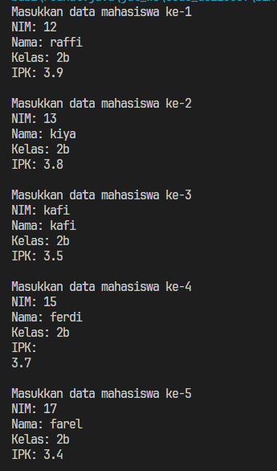

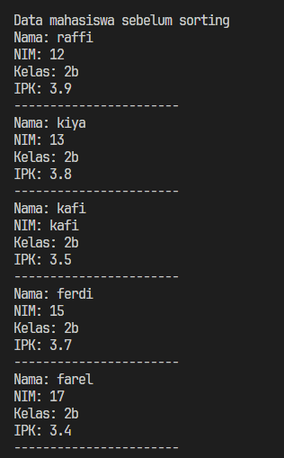

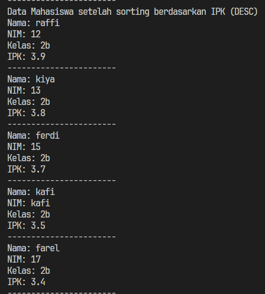

### 5.2.2 Mengurutkan Data Mahasiswa Berdasarkan IPK (Selection Sort)

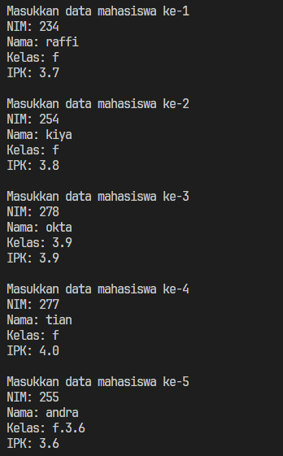

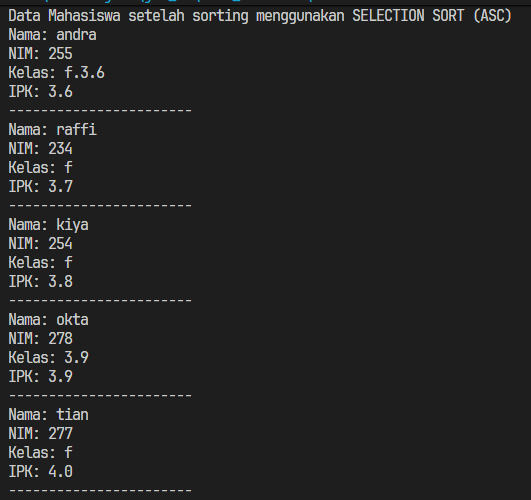

#### 5.2.2.1 Penjelasan Singkat
1. Dalam kelas mahasiswa berprestasi, buat method selection sort 
2. Method mengurutkan dengan cara mencari data terkecil di index sebelah kanan dan apakah lebih kecil dari index sekarang, jika iya posisinya ditukar
2. Jalankan method di mahasiswa demo 

#### 5.2.2.2 Pertanyaan
1. Baris kode program tersebut digunakan untuk menentukan index mana yang mempunyai nilai terkecil. Awalnya index i (index sekarang) dianggap paling kecil (idxmin), lalu dilihat seluruh nilai di index depannya satu persatu, jika lebih kecil dari idxmin, maka indexnya akan dimasukkan kedalam nilai idxmin. Dengan cara ini, kita dapat menemukan nilai terkecil setelah i dan lebih kecil dari i ada di index mana, kemudian ditukar posisinya dengan index tersebut.

### 5.2.3 Mengurutkan data Mahasiswa berdasarkan IPK menggunakan insertion sort

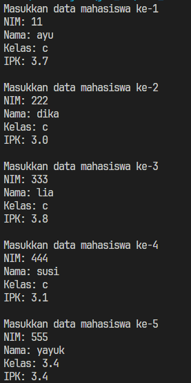

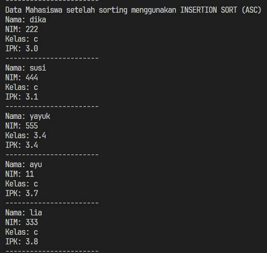

#### 5.2.3.1 Penjelasan Singkat 
1. Dalam kelas mahasiswa berprestasi, buat method  sort 
2. Method mengurutkan dengan cara mengelompokan data menjadi dua bagian, sorted dan unsorted, bagian unsorted akan di geser satu persatu ke bagian sorted di urutan yang benar
2. Jalankan method di mahasiswa demo

#### 5.2.3.2. Pertanyaan

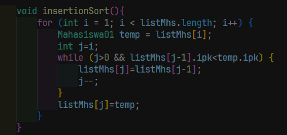
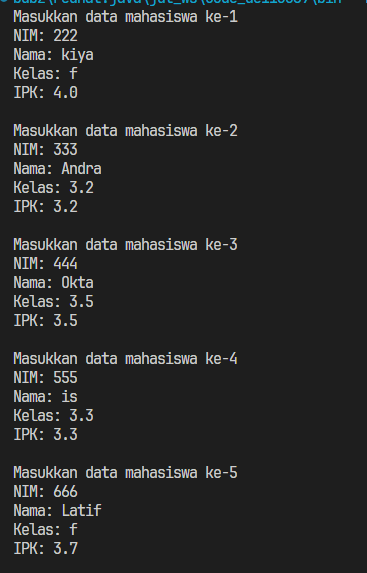
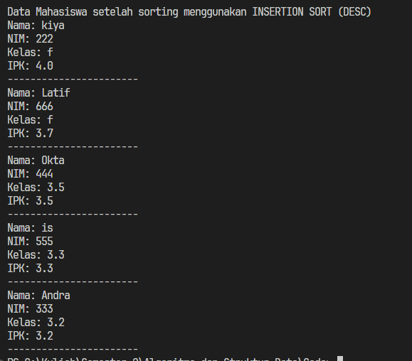

## 5.3 Tugas

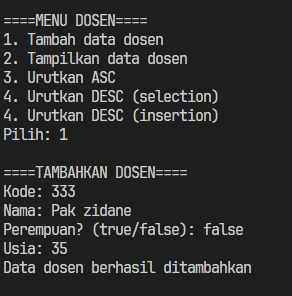

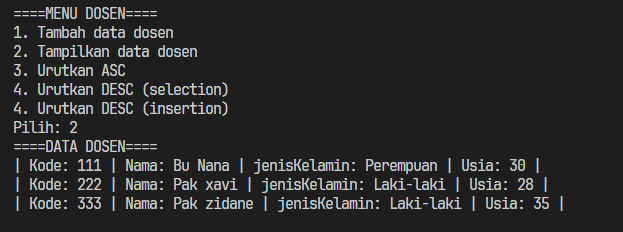

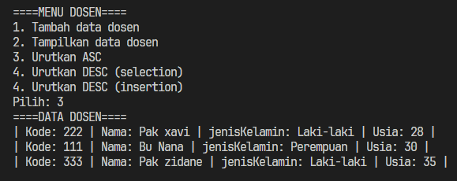

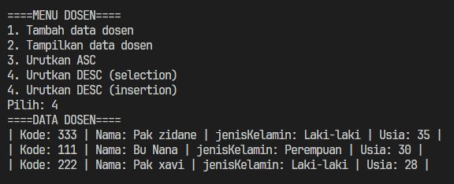

