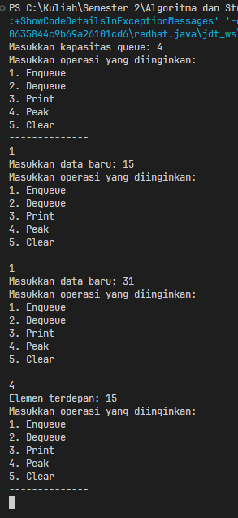
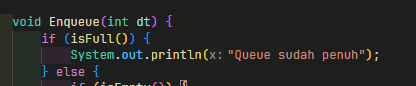
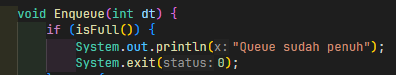
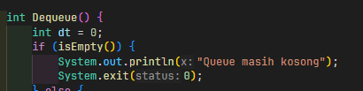
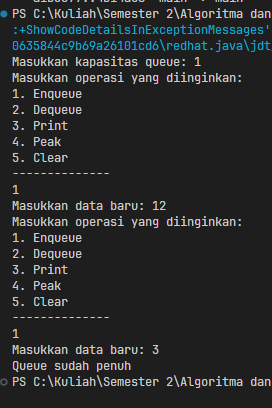
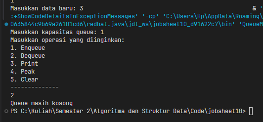
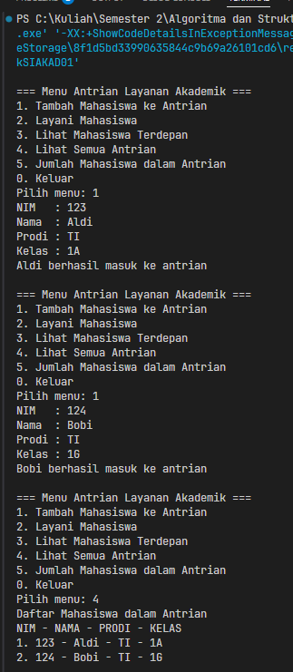
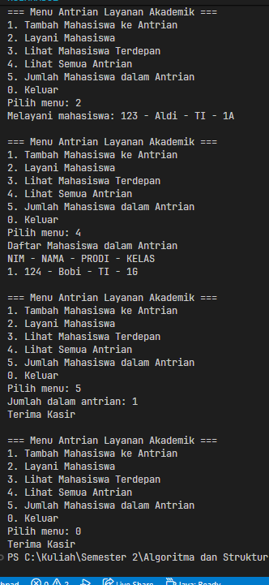

|  | Algorithm and Data Structure |
|--|--|
| NIM |  254107020097|
| Nama | Ahmad Raffi |
| Kelas | T1 - 1F |
| Repository | [link] (https://github.com/rapiBeginner/ASD-2026/blob/main/jobsheet10) |

# Labs #10 QUEUE
 ## 10.1 Percobaan 1

  

  ### 10.1.1 Penjelasan Singkat
  1. Buat kelas queue, dengan data dan method yang dibutuhkan
  2. Buat menu pada kelas main untuk menginstansiasi queue, mengisikan datanya, serta memanggil method berdasarkan menu yang dipilih
  3. Coba masukkan dua data dengan method enque, panggil method peak sekali untuk melihat data pertama yang dimasukkan

  ### 10.1.2 Pertanyaan
  1. Karena saat pertama kali diinstansiasi, queue awalnya masih kosong dan belum memiliki data di index manapun. Sehingga, front dan rear di isi dengan -1 untuk menunjukkan bahwa belum ada data didalamnya. Jika front dan rear di isi 0 seperti size, ini membuat front dan rear menunjuk kepada index pertama (0) bahkan ketika belum ada data disana, menyebabkan bug dimana kondisi isEmpty akan mengembalikan nilai false meskipun sebenarnya queue sedang kosong.
  2. Maksud dari kode ini, ketika kita hendak memasukkan data baru dan ternyata rear sudah berada di index paling belakang, tetapi array belum penuh (berarti index 0 masih kosong), maka kita akan menggeser rear nya ke depan (index 0), dan memasukkan data disana untuk mencegah overflow.
  3. Ini digunakan untuk memastikan ketika dequeue telah dilakukan (size sudah dikurangi), jika saat itu nilai front berada di ujung belakang array, dan saat ini array belum kosong (artinya masih ada data di index 0), maka front akan di geser ke depan (index)
  4. Karena jika dimulai dari i=0, hasil urutan print tidak akan sesuai dengan antrian yang sedang berlaku, dimana ketentuan antrian ini diawali oleh front dan diakhiri oleh rear, ditambah lagi ada kemungkinan error null pointer exception bila mana kita hendak mengakses data dari index yang sedang kosong
  5. Maksud dari kode tersebut, dia akan mencetak nilai sesuai indexnya ketika dia tidak sedang berada di baris terakhir (terus maju dengan +1), contoh jika max = 6, index terakhir 5, misal ingin mencetak urutan ke 3 dan 4,maka
  i = ( 2 + 1 ) % 6 = 3 % 6 = 3
  i = ( 3 + 1 ) % 6 = 4 % 6 = 4
  Namun, ketika dia berada di index paling belakang (dengan catatan index paling belakang tersebut tidak ditandai sebagai rear, maka dia akan kembali ke index 0 alias bagian depan array, karena dia belum menemukan rear)
  i = ( 5 + 1 ) % 6 = 6 % 6 = 0 (kembali ke depan)
  6. Potongan kode program yang merupakan queue overflow:

  

  7. Perubahan agar saat overflow dan underflow program berhenti

  

  

  

  

 ## 10.2 Percobaan 2

 

 

  ### 10.2.1 Penjelasan singkat
  1. Buat kelas Mahasiswa yang mengadopsi method dan atribut kelas queue
  2. Jalankan di main menu baru dengan memanggil berbagai method nya lewat pilihan menu yang tersedia

  

