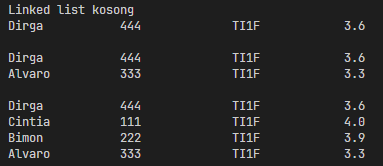
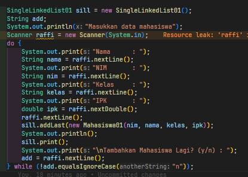
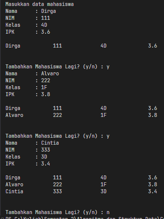

|  | Algorithm and Data Structure |
|--|--|
| NIM |  254107020097|
| Nama | Ahmad Raffi |
| Kelas | T1 - 1F |
| Repository | [link] (https://github.com/rapiBeginner/ASD-2026/blob/main/jobsheet11) |

# Labs #11 LINKED LIST
 ## 10.1 Percobaan 1

 

  ### 10.1.1 Penjelasan singkat
   1. Buat kelas mahasiswa
   2. Buat kelas node, yang atribut "data" nya diambil dari kelas mahasiswa.
   3. Buat kelas SingleLinkedList yang mehubungkan satu node ke node lain dengan berbagai methodnya, mulai dari head hingga tail
   4. Panggil method dari SingleLingkedList di main.

  ### 10.1.2 Pertanyaan
   1. Mengapa hasil compile kode program di baris pertama menghasilkan “Linked List Kosong”?
   : Karena pada saat pertama kali sll.print() dipanggil, kita belum menjalankan method add apapun untuk menambahkan data ke linkedlist, baik itu addFirst, addLast(), ataupun method insert yang lain. 

   2. Jelaskan kegunaan variable temp secara umum pada setiap method!
   : Kebanyakan variabel temp digunakan untuk melakukan traversal dari satu node ke node lain tanpa menggeser posisi head.

   3. Lakukan modifikasi agar data dapat ditambahkan dari keyboard!
   : 
   
   

   

