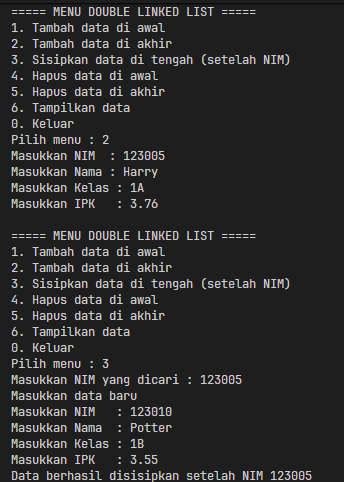
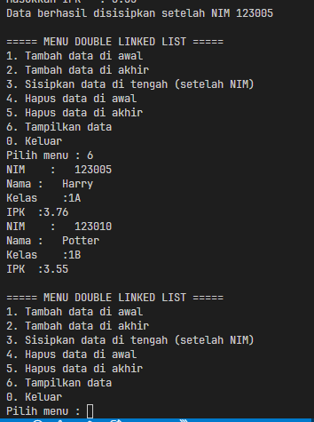
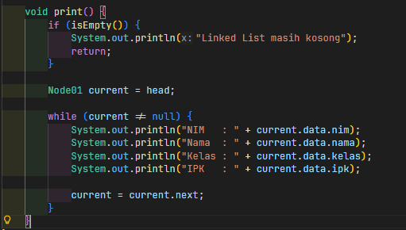
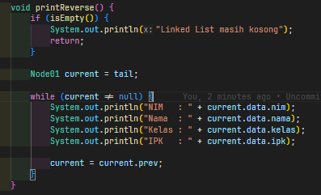
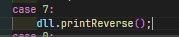
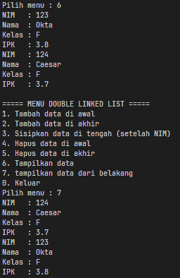
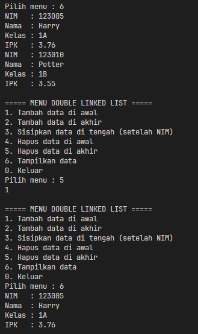
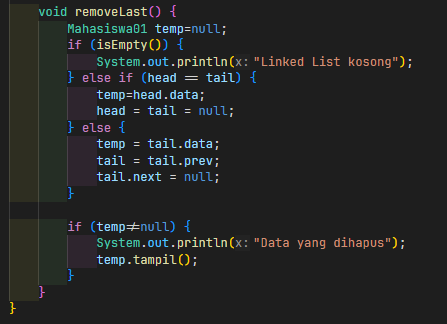
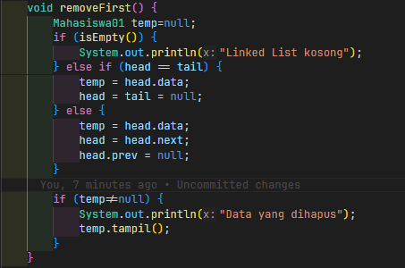
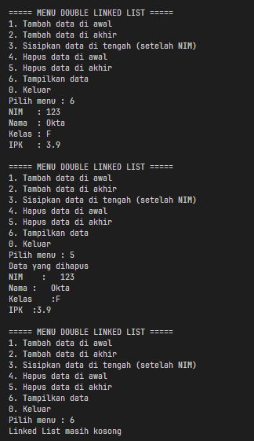

|  | Algorithm and Data Structure |
|--|--|
| NIM |  254107020097|
| Nama | Ahmad Raffi |
| Kelas | T1 - 1F |
| Repository | [link] (https://github.com/rapiBeginner/ASD-2026/blob/main/jobsheet12) |

# Labs #12 DOUBLE LINKED LIST
 
 ## 12.1 Percobaan 1
 

 

  ### 12.1.1 Penjelasan Singkat
  1. Buat node dengan data mahasiswa
  2. Buat double linked list dengan berbagai methodnya
  3. Jalankan di main

  ### 12.1.2 Pertanyaan
  1. Single linked list hanya bisa melakukan traversal dari depan ke belakang, sementara double linked list mampu melkakukannya secara dua arah, baik maju ataupun mundur dikarenakan tambahan pointer prev yang merujuk ke node sebelumnya
  2. pointer prev digunakan untuk merujuk ke node sebelumnya, bisa digunakan untuk traversal dari belakang ke depan, akan dihubungkan ke node baru yang ditambahkan didepan node tersebut. Sementara next digunakan untuk merujuk ke kode setelahnya, membantu traversal dari depan ke belakang, akan dihubungkan ke node baru yang ditambahkan dibelakang node tersebut
  3. Konstruktor tersebut memastikan bahwa saat linked list pertama kali diinisialiasi, maka isinya masih kosong (head dan tail di isi null, menandakan tidak ada data didepan, dibelakang, ataupun diantaranya)
  4. Karena ketika linked list masih kosong, data yang pertama masuk berperan sebagai yang pertama dan terakhir, sehingga ditandai sebagai head sekaligus tail.
  5. 
  
  

  6. 

  

  

  

 ## 12.2 Percobaan 2

 

  ### 12.2.1 Penjelasan singkat
  1. Tambahkan method untuk menghapus data terakhir dan pertama
  2. Panggil di main

  ### 12.2.2 Pertanyaan
  1. Potongan kode tersebut awalnya menggeser status head, dari head yang sekarang ke node setelahnya. Lalu, head yang baru ini diputus koneksinya dengan head yang lama sehingga head yang lama dianggap hilang / dihapus. Ini berlaku untuk deleteFirst (menghapus data paling depan).
  2. 

  

  

  
