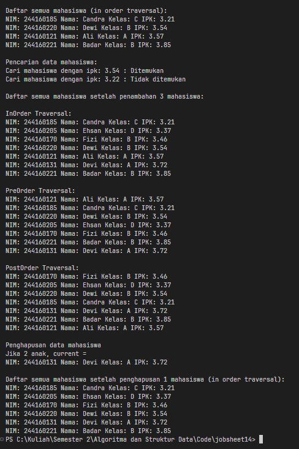

|  | Algorithm and Data Structure |
|--|--|
| NIM |  254107020097|
| Nama | Ahmad Raffi |
| Kelas | T1 - 1F |
| Repository | [link] (https://github.com/rapiBeginner/ASD-2026/blob/main/jobsheet14) |

# Labs 14 Tree
 
 ## 14.1 Percobaan 1
 
   
  ### 14.1.1 Pertanyaan
  1. Karena pada Binary Search Tree setiap node disusun dengan aturan bawha nilai yang lebih kecil akan berada di node kiri dan yang nilainya lebih besar diletakkan pada subtree sebelah kanan. Mengikuti aturan ini membuat pencarian data menjadi lebihh efektif karena program tidak harus menelusuri seluruh node yang ada
  2. Node left dan right digunakan untuk menghubungkan node tersebut dengan anak kiri dan anak kanannya, agar terbentuk struktur tree
  3. 
  a. Root digunakan untuk merujuk kepada node paling awal atau pada heirarki teratas sebuah tree. Node ini yang akan menjadi rujukan untuk menjelajahi node-node dibawahnya
  b. Saat tree pertama kali dibuat, nilai root adalah null (kosong)

  4. Saat ditambahkan node baru ke tree yang masih kosong, maka node tersebut akan langsung dijadikan root dalam tree tersebut

  5. Program tersebut digunakan untuk menentukan arah pencarian posisi untuk meletakkan node baru. Jika ipk pada node baru lebih kecil dari IPK node saat ini, maka akan menelusuri jalur sebelah kiri, tetapi jika lebih besar akan ke sebelah kanan.

  6. 
   1. Cari node yang akan dihapus 
   2. Setelah ditemukan, cari successor dari node tersebut dengan method getSuccessor
   3. Method tersebut akan mengembalikan node dengan nilai terkecil dari subtree sebelah kanan
   4. Ganti posisi node yang dihapus dengan successor
   5. Perbaiki hubungan child kiri dan kanan
   7. Node successor yang lama kemudian dihapus dari posisi asalnya.
   