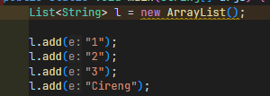
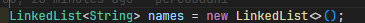
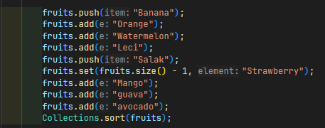

|  | Algorithm and Data Structure |
|--|--|
| NIM |  254107020097|
| Nama | Ahmad Raffi |
| Kelas | TI - 1F |
| Repository | [link] (https://github.com/rapiBeginner/ASD-2026/blob/main/jobsheet16) |

# Labs #16 Collection
## 16.1 Percobaan 1

### 16.1.2 Pertanyaan
1. Mengapa semua jenis data bisa ditampung ke dalam sebuah ArrayList pada baris 25-36?
: Karena objek l diinisialisasi tanpa menentukan tipe data generik (List l = new ArrayList();) . Secara default, ArrayList tersebut akan menampung data dengan tipe objek dasar (Object), sehingga semua class turunan dari Object (termasuk Integer dan String) dapat dimasukkan ke dalamnya .

2. Modifikasi baris kode 25-36 sehingga data yang ditampung hanya satu jenis atau spesifik tipe tertentu!

3. Ubah names jadi linkedlist

4. tambahkan names.push

5. Dari penambahan kode tersebut, silakan dijalankan dan apakah yang dapat Anda jelaskan!
: Fungsi push() merupakan bagian dari interface Deque yang diimplementasikan oleh LinkedList . Fungsi ini memasukkan elemen baru ke bagian awal/depan list (indeks 0) . Oleh karena itu, "Mei-mei" bergeser menjadi elemen pertama menggantikan "Noureen", sementara elemen terakhir tetap "Al-Qarni" .

## 16.2 Percobaan 2

### 16.2.1 Pertanyaan
1. Apakah perbedaan fungsi push() dan add() pada objek fruits?
: Fungsi push() adalah method spesifik dari class Stack yang digunakan untuk memasukkan elemen ke dalam tumpukan paling atas (mengikuti prinsip LIFO). Sedangkan add() adalah method bawaan dari interface Collection / List yang diturunkan ke class Stack untuk menambahkan elemen ke posisi paling akhir dari list tersebut.

2. Silakan hilangkan baris 43 dan 44 (fruits.push("Melon"); dan fruits.push("Durian");), apakah yang akan terjadi? Mengapa bisa demikian?
: Tiga proses perulangan di bawahnya (menggunakan Iterator, Stream, dan for loop biasa) tidak akan menampilkan data apa pun atau menghasilkan baris kosong. Hal ini terjadi karena sebelum baris tersebut, semua elemen di dalam fruits telah habis dikeluarkan dari stack melalui perulangan while (!fruits.empty()) { fruits.pop(); }.

3. Jelaskan fungsi dari baris 46-49 (Perulangan Iterator)?
: Potongan kode tersebut berfungsi untuk menjelajahi dan menampilkan setiap elemen di dalam objek fruits secara berurutan menggunakan objek Iterator. Method it.hasNext() memeriksa apakah masih ada elemen selanjutnya, dan it.next() digunakan untuk mengambil elemen tersebut.

4. Silakan ganti baris kode 25, Stack<String> menjadi List<String> dan apakah yang terjadi? Mengapa bisa demikian?
: Akan terjadi error saat kompilasi program. Hal ini disebabkan karena method empty() dan pop() adalah method spesifik milik class Stack, sehingga method tersebut tidak didefinisikan dan tidak bisa dipanggil apabila objek dideklarasikan menggunakan interface List.

5. Ganti elemen terakhir dari objek fruits menjadi "Strawberry"!

6. Tambahkan 3 buah seperti "Mango", "guava", dan "avocado" kemudian dilakukan sorting!

