|  | Algorithm and Data Structure |
|--|--|
| NIM |  254107020097|
| Nama | Ahmad Raffi |
| Kelas | T1 - 1F |
| Repository | [link] (https://github.com/rapiBeginner/ASD-2026/blob/main/Jobsheet9) |

# Labs #10 STACK
 ## 10.1 Percobaan 1

  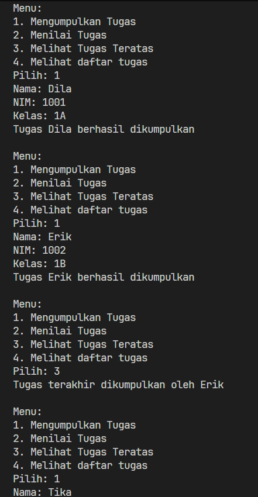

  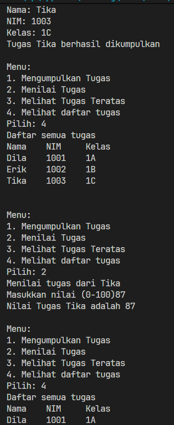

  ### 10.1.1 Penjelasan Singkat
  1. Objek stack memiliki beberapa method dan atribut untuk mengatur data mahasiswa
  2. Menu satu akan mengumpulkan tugas meletakkannya di tumpukan paling atas
  3. Menu dua memberi nilai tugas kepada data ditumpukan paling atas (yang terakhir masuk)
  4. Menu empat menunjukkan siapa yang terakhir dikumpulkan tugasnya (paling atas di tumpukan)
  5. Menu lima menampilkan daftar tugas urut dari bawah

  ### 10.1.2 Pertanyaan
  1. 

  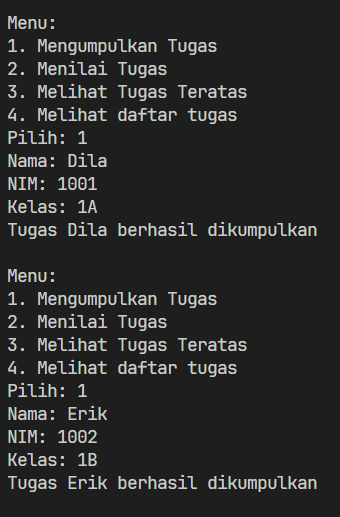

  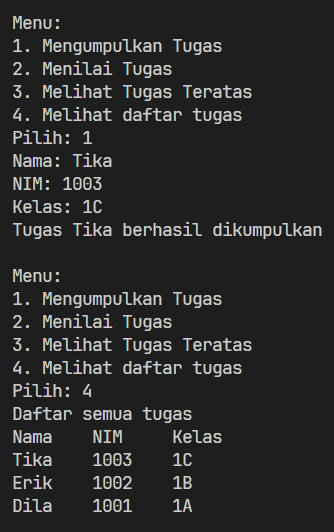

  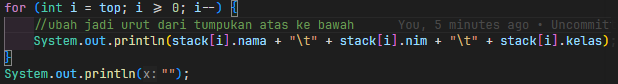 

  2. Didalam class stack sebenarnya jumlah mahasiswa yang ditampung bebas tergantung berapa jumlah yang ditentukan saat instansiasi objek stack, dimana kebetulan dalam main method ditentukan size nya 5

  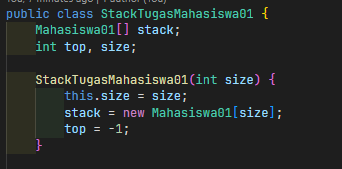 

  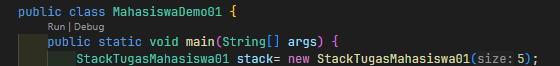 

  3. Pengecekan kondisi isFull() diperlukan agar tidak terjadi error index array out of bound, yang terjadi ketik sebuah array sudah penuh dan kita mencoba mengakses atau mengisi array pada index diluar batas maksimumnya

  4. 

  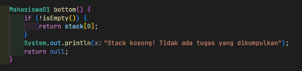

  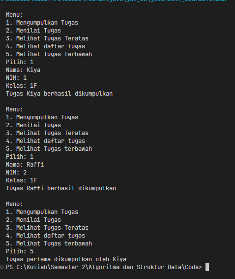

  5.

  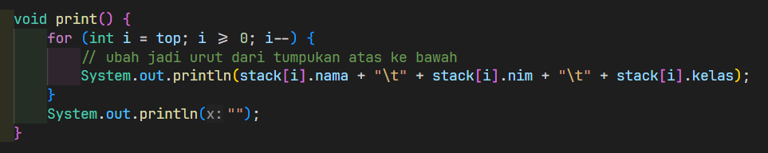

  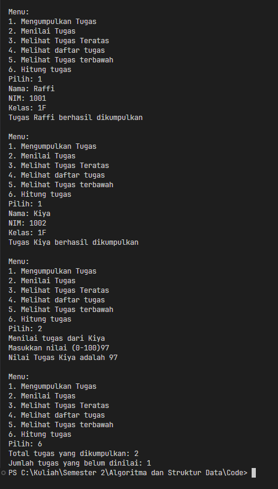 

 ## 10.2. Percobaan 2

 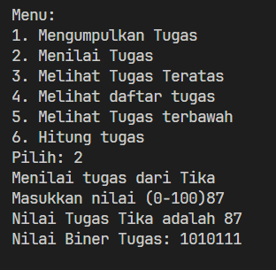

 ### 10.2.1 Penjelasan singkat
 1. Buat kelas stack biner untuk menampung nilai dan dan mengkonversinya ke biner
 2. Buat objek stack binner dalam method konversi biner pada kelas stack tugas.
 3. Panggil method konversi biner di main method setiap kali menu memberi nilai dijalankan

 ### 10.2.2 Pertanyaan
 1. Awalnya dibuat sebuah objek stack biner dari kelas yang sudah ada sebelumnya. Kemudian, dilakukan perulangan dengan terus mengambil sisa bagi dari nilai (parameter) ketika dibagi 2, setiap hasil bagi di satu kali loop akan dimasukan ke dalam stack biner. Setelah nilai mencapai 0 maka proses bagi berhenti. Tahap selanjutnya, buat sebuah variabel string biner, kemudian buat perulangan kedua. Pada perulangan ini semua data biner yang ada di stack biner tadi dikeluarkan dan dimasukkan ke string biner (diambil urut dari tumpukan biner yang terakhir masuk/paling atas)

 2. Tidak ada perubahan siginifikan baik menggunakan > 0 atau != 0, ini dikarenakan
 keduanya akan tetap menghentikan perulangan ketika nilai sudah mencapai 0 setelah terus dibagi 2.

 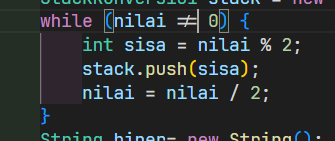

 